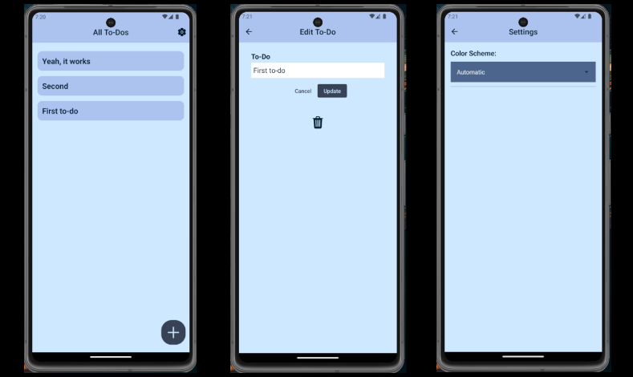
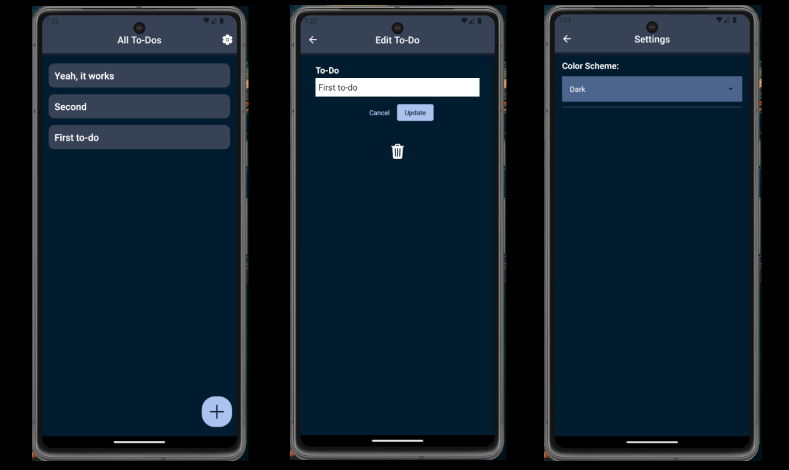

# Todo-App with React Native

A simple to-do app built in React Native. Expo-sqlite was used to manage locally stored data, incorporating fundamental CRUD operations.

To handle styling, styled-components was utilized to adapt the design based on the user's device theme. Additionally, a basic settings screen was implemented, allowing users to choose between light, dark, or automatic (system) themes.

There are three other branches:

1. static-theme: the first version of this app. It only shows the app with the dark theme.

2. automatic-theme: version "2.0". This version automatically changes the theme based on the device theme (There is no settings screen yet).

3. final-ts: It has the same features as the main branch, but now using TypeScript (it wasn't finished).

## Preview

### Light Theme

### Dark Theme

